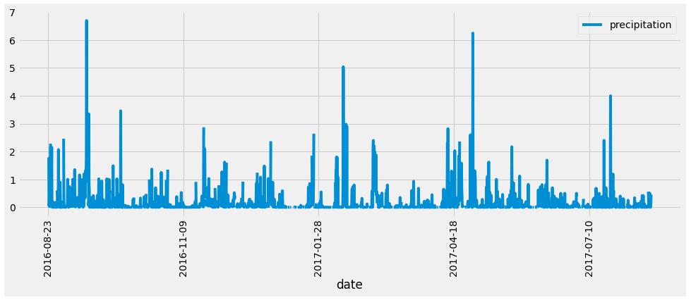
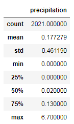
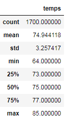
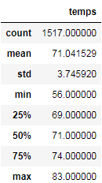

# surfs_up

## Module Project Overview

W. Avy wants to open up a Surf and Ice Cream store in Oahu, Hawaii. This analysis is to analyze the weather data to see if Oahu is a good fit or not for this business.

Now, let's think about precipitation. W. Avy is concerned about the amount of precipitation on Oahu. There needs to be enough rain to keep everything green, but not so much that you lose out on that ideal surfing and ice cream weather.

It occurs to you that he hasn't asked for an analysis of the temperature yet, so you decide to dive into temperature data.
 
## Resources:
  - Data Source: hawaii.sqlite
  - Software: anaconda3, python 3.7.7, jupyter notebook, flask
  - Library: matplotlib, pandas, numpy, datetime, sqlalchemy, and flask

## Module Project Analysis

Based on the weather data provided by W. Avy in sqlite file, analysis was done to find the amount of precipitation on each day for a year between Aug - 2016 to Aug - 2017. The data is then plotted in the chart shown below.

plot:

Statistics for the year length on precipitation data is as follows:

## Challenge Overview

W. Avy liked the above analysis, and he wanted more information about temperature trends before opening the surf shop. Specifically, he wanted temperature data for the months of June and December in Oahu, in order to determine if the surf and ice cream shop business is sustainable year-round.

## Challenge Analysis

Analysis was done by extracting all of June temperature data and December temperature data. The statistics are displayed below.

June:

 
December:

Based on the information we can recommend that opening surf and icecream shops in Oahu is a sound investment. With temperatures @70+ deg F, Oahu is a good place to surf and have icecreams after surfing.

